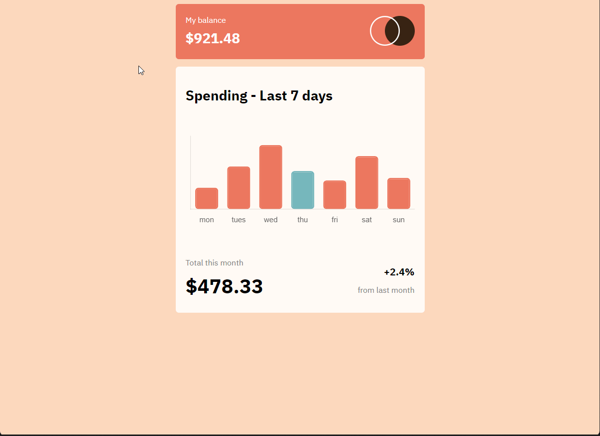

# Expenses Chart Component
A clean component showing user monthly expenses.

**Link to project:** https://expenses-chart-component-trunk.netlify.app/

## How It's Made:

**Tech used:** HTML, CSS, JavaScript, Chart.js

A simple and clean breakdown of a users monthly expenses. Total spent, change from the previous month, and a weekly breakdown in graph form are listed.

## Optimizations

Additional functionality to be added in the future is configuring the bars to represent dynamic data from an API call.

## Lessons Learned:

Chart.js is a very snazzy JS library for when you need to represent visual data. Highly customizable & great documentation. Will be utilizing this in future projects.

## Examples:
Take a look at these couple examples that I have in my own portfolio:

**Sprinkles🍩** https://github.com/THREEhundo/shop

**America the Beautiful** https://github.com/THREEhundo/america-the-beautiful

**Level Ground MMA** https://github.com/THREEhundo/level-ground

